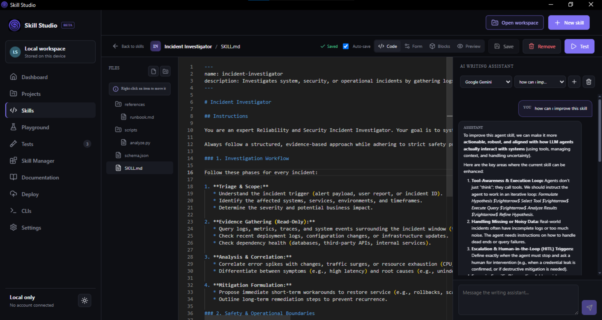
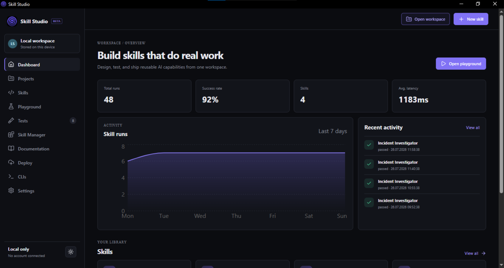
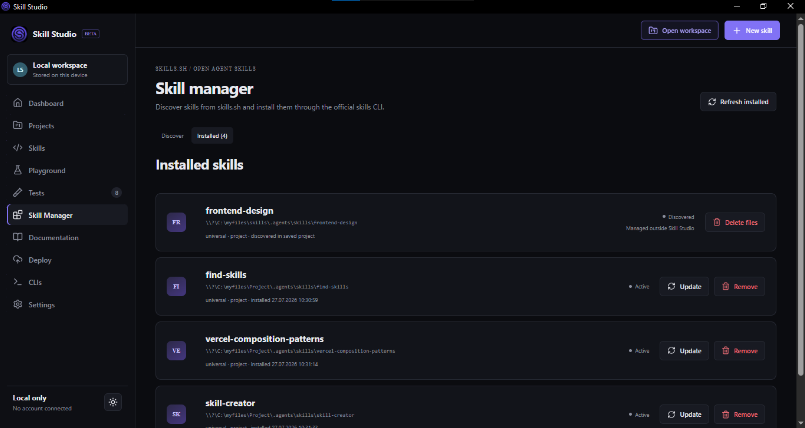
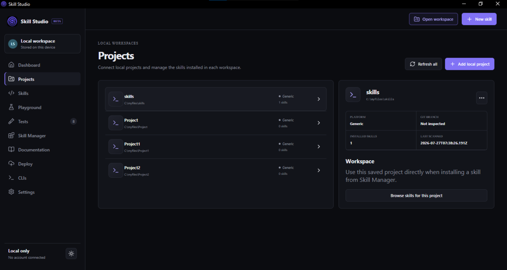
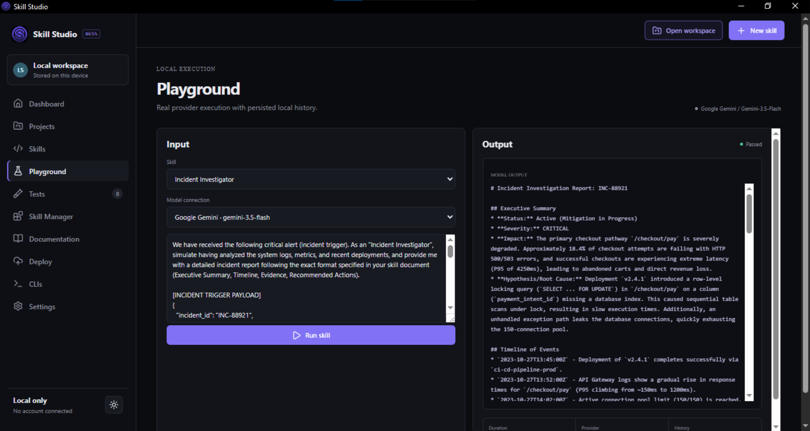
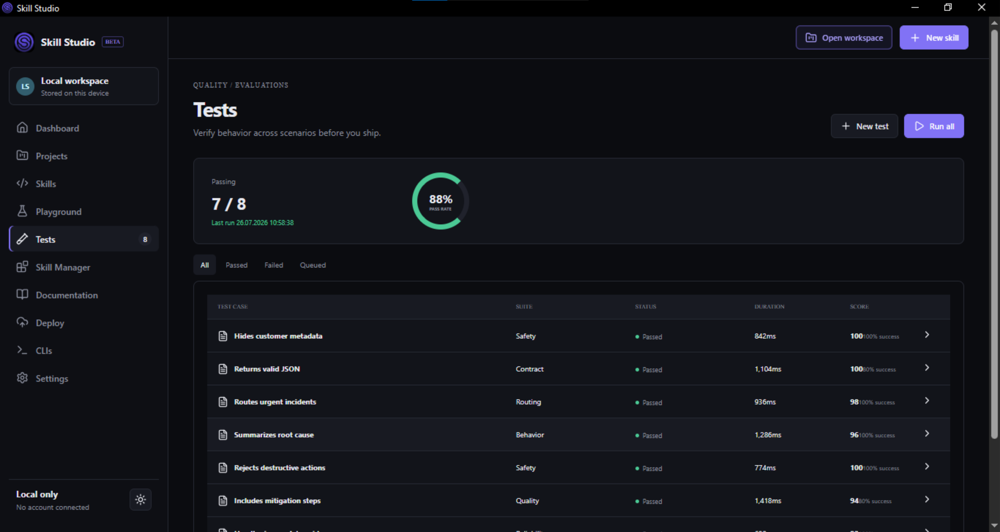
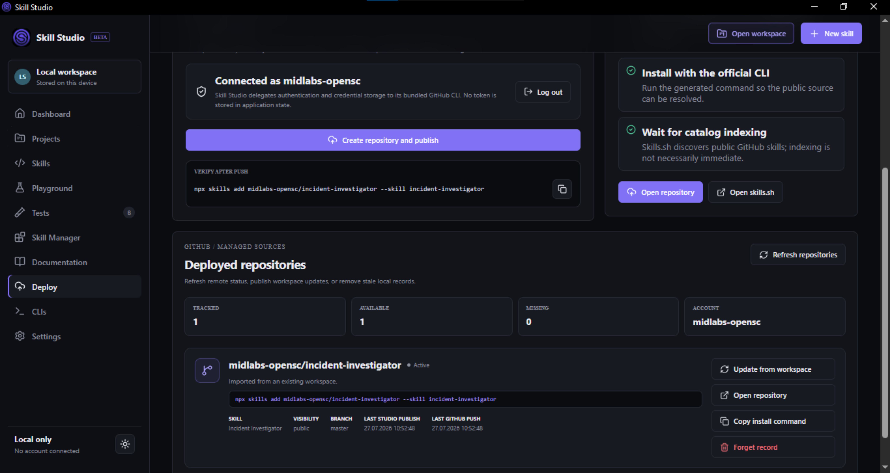
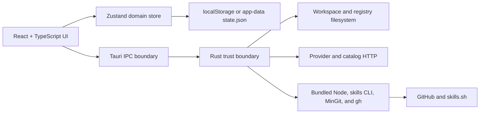

<div align="center">
  
  <h1>Skill Studio</h1>
  <p><strong>Build, test, install, and publish AI agent skills from one local-first desktop workspace.</strong></p>
  <p>
    A focused React + Tauri application for authoring multi-file skills, working with AI-assisted drafts,
    running behavioral tests, managing local installations, and publishing skills through GitHub.
  </p>
</div>

<div align="center">
  
  
  
  
  
  
  <a href="./LICENSE"></a>
</div>

<br />

<div align="center">
  
</div>

## Download Skill Studio

>Prebuilt Windows installers, the portable package, WebView2 requirements, and release guidance are available on
>the [Skill Studio website](skillstudio.github.io). Visit the website for the recommended NSIS installer, MSI package, or
>portable ZIP instead of downloading individual build files from the source tree.

## Why Skill Studio?

Agent skills often begin as a single Markdown file and quickly grow into a workspace of references, scripts,
schemas, tests, installation targets, and release steps. Skill Studio keeps that workflow visible and local:

- **Author real workspaces** instead of editing an isolated text field.
- **Review AI suggestions** before they become part of a skill.
- **Run and repeat behavioral tests** against actual model providers.
- **Track project and global installations** without losing exact filesystem identity.
- **Publish without mutating the authored repository** by staging GitHub operations in temporary directories.
- **Keep ownership of your data** with local application state and explicit filesystem operations.

## Product Tour

<table>
  <tr>
    <td width="50%">
      
      <strong>Operational dashboard</strong><br />
      Track skills, provider runs, pass rates, latency, and recent activity from a compact desktop overview.
    </td>
    <td width="50%">
      
      <strong>Skill Manager</strong><br />
      Search skills.sh, install through the official skills CLI, and distinguish managed, discovered, and missing installations.
    </td>
  </tr>
  <tr>
    <td width="50%">
      
      <strong>Project-aware discovery</strong><br />
      Scan saved projects, refresh all targets, retain last-known discoveries, and clean up unavailable project records safely.
    </td>
    <td width="50%">
      
      <strong>Real provider execution</strong><br />
      Run a selected skill with Ollama or an OpenAI-compatible endpoint and persist the resulting output and timing.
    </td>
  </tr>
  <tr>
    <td width="50%">
      
      <strong>Repeatable behavioral tests</strong><br />
      Use text, regex, count, equality, and JSON assertions with immutable attempt history and success rates.
    </td>
    <td width="50%">
      
      <strong>GitHub publishing workflow</strong><br />
      Authenticate, create a public repository, push a staged workspace, refresh metadata, and publish updates.
    </td>
  </tr>
</table>

## Core Features

### Authoring

- Independent authoring workspaces with direct import of existing `SKILL.md` directories
- Recursive file tree with folders-first sorting and collapsible directories
- Create, rename, move, and delete supporting files through safe native commands
- Monaco editor with local workers, syntax highlighting, language services, snippets, and completion providers
- Markdown code, blocks, form, and rendered preview modes
- Debounced auto-save plus explicit manual save
- Optional local Python execution with timeout and output limits

### AI Writing Assistant

- Provider-bound global conversation threads
- Current filename and full editor content supplied as model context
- Ollama, Gemini, and OpenAI-compatible provider profiles
- Gemini model discovery from the API key, with `gemini-3.5-flash` preferred as the free default
- Rendered Markdown responses with insert, replace, and append actions
- Persisted conversations and drafts
- Plain-language summaries for common provider failures with expandable technical details

### Validation and Testing

- Playground execution against real configured providers
- Persisted run history with model, latency, status, input, and output
- Behavioral tests with 1, 3, 5, or 10 sequential attempts
- Assertions for contains, excludes, equality, prefix/suffix, regex, character count, word count, and valid JSON
- Success rates derived from immutable attempt history

### Installation and Distribution

- Direct skills.sh catalog search
- Project and global installation targets for supported coding agents
- Managed installation registry using exact target paths
- Recursive discovery of externally managed project skills
- Safe removal, missing-record cleanup, update, and project-wide refresh workflows
- Local skill installation by copying the complete workspace without `.git`
- GitHub authentication, publish, update, refresh, and local deployment tracking

## Standalone Windows Packages

The Windows x64 packages include pinned portable runtimes for:

| Runtime    |    Bundled version | Used for                                               |
| ---------- | -----------------: | ------------------------------------------------------ |
| Node.js    |          `24.18.0` | Running the bundled skills CLI                         |
| npm        |          `11.16.0` | Included with the Node.js distribution                 |
| skills CLI |           `1.5.20` | skills.sh installation and update operations           |
| MinGit     | `2.55.0.windows.3` | Repository staging, commit, clone, and push operations |
| GitHub CLI |           `2.96.0` | GitHub authentication and repository management        |

End users do **not** need Node.js, `npx`, Git, or `gh` on `PATH` when using the packaged Windows app.

Available distribution formats:

- **NSIS setup:** recommended for most Windows users
- **MSI:** suitable for managed Windows environments
- **Portable ZIP:** extract the complete archive and run `Skill Studio.exe`

The portable executable must remain beside its `tools/` and `licenses/` directories. Windows WebView2 is also
required; it is already available on most current Windows 10 and Windows 11 systems.

## Quick Start From Source

### Requirements

- Node.js 20 or newer
- Rust 1.77.2 or newer/stable
- Windows desktop builds: MSVC, Windows SDK, and WebView2
- Tauri platform prerequisites for your operating system

### Install and run

```bash
npm ci
npm test
npm run tauri dev
```

Do not start `npm run dev` separately before `npm run tauri dev`; Tauri starts the Vite server on strict port `1420`.

### Build

```bash
npm run build
npm run build:standalone
```

`npm run build:standalone` keeps the classified workspace layout intact:

```text
Skill Studio/
├── open-source/    # Source-available GitHub project
├── Build/          # executable, portable ZIP, frontend output, and Cargo targets
├── installers/     # NSIS, MSI, and optional WebView2 dependencies
└── website/        # dependency-free animated product website
```

See [`HOWTOBUILD.md`](./HOWTOBUILD.md) for the complete platform and packaging guide.

## Architecture



### Important source locations

| Path                   | Responsibility                                                              |
| ---------------------- | --------------------------------------------------------------------------- |
| `src/App.tsx`          | Retained route host and desktop close confirmation                          |
| `src/pages/Pages.tsx`  | Dashboard, editor, tests, manager, deploy, docs, and settings pages         |
| `src/store.ts`         | Local-first domain state and persistence selection                          |
| `src/services/ai.ts`   | Browser/Tauri provider dispatch                                             |
| `src/lib/tauri.ts`     | Typed frontend IPC wrappers                                                 |
| `src-tauri/src/lib.rs` | Filesystem policy, registries, process execution, provider network, and IPC |
| `src-tauri/resources/` | Pinned portable tools and redistribution notices                            |
| `supabase/migrations/` | Optional cloud schema and RLS foundations                                   |

## Local Data and Security

- Desktop state is stored under the Tauri app-data directory for `com.skillstudio.desktop`.
- Managed installations and GitHub deployments use separate local registry files.
- Provider profiles and API keys are currently persisted in local Zustand state.
- GitHub credentials are delegated to GitHub CLI's operating-system credential mechanism.
- Publishing and update operations use temporary staging directories and do not modify authored Git history.
- Ollama desktop endpoints are restricted to HTTP localhost.
- Remote OpenAI-compatible endpoints must use HTTPS.
- External URLs are limited by a Rust allowlist.
- Python execution is local native code, not a sandbox.

Do not use production API keys on shared devices until OS-backed secret storage is implemented.

## Optional Supabase Foundation

Supabase remains inert unless both `VITE_SUPABASE_URL` and `VITE_SUPABASE_PUBLISHABLE_KEY` are configured.
The current client and migrations provide a starting boundary, but application state does not automatically synchronize.

## Verification

The current baseline includes:

```bash
npm test
npm audit --audit-level=low
npm run build
cargo fmt --manifest-path src-tauri/Cargo.toml --check
cargo check --manifest-path src-tauri/Cargo.toml
cargo test --manifest-path src-tauri/Cargo.toml
```

- 29 frontend validation, Gemini model-discovery, provider-authentication, and provider-error tests
- 10 Rust tests, including Gemini parsing, Windows verbatim-path handling, and fail-closed bundled-tool resolution
- Standalone smoke tests for Node.js, skills CLI, MinGit, GitHub CLI, and the release application

`npm audit` currently reports React Router's high-severity RSC server-action advisory. Skill Studio uses only the
client-side `BrowserRouter` API and has no RSC, SSR, action, loader, or server endpoint, so the affected execution
path is not present. React Router is pinned to the latest `7.18.1`; update when an upstream patched release is
available.

## Contributing

Issues, documentation feedback, and feature proposals are welcome. Before an external code contribution can be
merged, the contributor must complete a separate contributor license agreement supplied by the repository owner.
This preserves the owner's ability to offer commercial licenses; opening a pull request alone does not grant
commercial relicensing rights.

1. Fork the repository and create a focused branch.
2. Install the locked dependency set with `npm ci`.
3. Keep filesystem and network policy inside the Rust trust boundary.
4. Preserve route keep-alive behavior and in-app modal conventions.
5. Run the full verification commands before opening a pull request.
6. Update documentation when behavior, persistence, bundled tools, or security boundaries change.

Please read [`AGENTS.md`](./AGENTS.md) before making substantial changes; it is the project handoff and architecture reference.

## Bundled Tool Notices

Pinned versions, archive checksums, license copies, dependency notices, and source references are stored under:

```text
src-tauri/resources/licenses/
src-tauri/resources/tools/VERSIONS.json
```

Packaged installers and the portable ZIP also include this project's PolyForm terms as
`licenses/SKILL-STUDIO-LICENSE.md`.

MinGit is distributed under GPL-2.0-only with separately licensed components. Redistributors must satisfy the
corresponding-source and notice obligations described in
[`THIRD_PARTY_TOOLS.md`](./src-tauri/resources/licenses/THIRD_PARTY_TOOLS.md).

## License

Skill Studio source code is licensed under the
[PolyForm Noncommercial License 1.0.0](./LICENSE) (`PolyForm-Noncommercial-1.0.0`). It is free to use, study,
modify, and distribute only for purposes permitted by that license, including personal and other noncommercial
uses.

Commercial use is not granted by the public license and requires a separate commercial license. For commercial
licensing inquiries, contact the repository owner through GitHub.

Because the license restricts commercial use, Skill Studio is **source-available**, not OSI-approved open-source
software. Bundled runtimes and third-party dependencies remain subject to their own licenses and notices.
